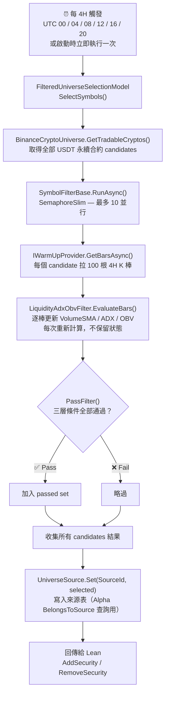

# LiquidityAdxObvFilter — Live 篩選流程

每 4H 從 Binance 撈所有 USDT 永續合約，透過三層指標篩選後回傳給 Lean，決定哪些標的可以進場。

---

## 完整 Live 流程



---

## 三層篩選條件

三層條件皆需通過（AND 邏輯），任一層不過即淘汰。

| 層 | 目的 | 指標 | 通過條件 |
|:---:|---|---|---|
| 第一層 | 流動性 | `VolumeSMA(10)` | 過去 10 根 4H 成交金額均值 ≥ **100 萬 USDT** |
| 第二層 | 趨勢活躍度 | `ADX(14)` + 當前 4H 成交金額 | ADX ≥ **35** 且 當前成交金額 > SMA × **1.5** |
| 第三層 | 量能持續性 | `OBV` + `OBV_SMA(10)` | OBV > OBV_SMA(10) |

---

## Code Snippets

### EvaluateBars vs OnFourHourBar — 呼叫時機比較

| | `EvaluateBars` | `OnFourHourBar` |
|---|---|---|
| **觸發者** | `SymbolFilterBase.RunAsync` | `TradeBarConsolidator.DataConsolidated` 事件 |
| **觸發頻率** | 每 4H 跑一次，一次處理所有 candidates | 每根 4H K 棒收盤後逐棒觸發 |
| **輸入資料** | 一次收到 100 根 K 棒（REST 批次拉取） | 每次收到 1 根 K 棒（Lean feed 串流） |
| **指標狀態** | Stateless — 每次建新 `FilterData` | Stateful — `FilterData` 存在 `_filterData` dict，跨棒累積 |
| **更新範圍** | 只判斷當前 symbol，回傳 `bool` | 更新當前 symbol 後，重掃全部 symbols 刷新 `ActiveSymbols` |

### EvaluateBars — 批次計算（Live）

每次呼叫建立全新 `FilterData`，不沿用前次狀態。

```csharp
protected override bool EvaluateBars(Symbol symbol, IEnumerable<TradeBar> bars)
{
    var fd = new FilterData();
    foreach (var bar in bars)
    {
        var usdtVolume = bar.Volume * bar.Close;
        fd.CurrentUsdtVolume = usdtVolume;
        fd.VolumeSma.Update(bar.EndTime, usdtVolume);
        fd.Adx.Update(bar);
        fd.Obv.Update(bar);
        if (fd.Obv.IsReady)
            fd.ObvSma.Update(bar.EndTime, fd.Obv.Current.Value);
    }
    return PassFilter(fd);
}
```

### OnFourHourBar — 逐棒累積（回測）

每根 4H K 棒收盤後觸發，更新當前 symbol 的持久 `FilterData`，再重掃所有 symbols 刷新 `ActiveSymbols`。

```csharp
private void OnFourHourBar(object sender, TradeBar bar)
{
    var filterData = _filterData[bar.Symbol];
    var usdtVolume = bar.Volume * bar.Close;

    filterData.CurrentUsdtVolume = usdtVolume;
    filterData.VolumeSma.Update(bar.EndTime, usdtVolume);
    filterData.Adx.Update(bar);
    filterData.Obv.Update(bar);
    if (filterData.Obv.IsReady)
        filterData.ObvSma.Update(bar.EndTime, filterData.Obv.Current.Value);

    var active = new HashSet<Symbol>();
    foreach (var kvp in _filterData)
    {
        if (PassFilter(kvp.Value))
            active.Add(kvp.Key);
    }
    ActiveSymbols = active;
}
```

### PassFilter — 三層條件判斷

```csharp
private bool PassFilter(FilterData filterData)
{
    if (!filterData.VolumeSma.IsReady || !filterData.Adx.IsReady || !filterData.ObvSma.IsReady)
        return false;

    // 第一層：流動性
    var isOverAmount = filterData.VolumeSma.Current.Value >= 1_000_000m;

    // 第二層：趨勢活躍度
    var isTrend = filterData.Adx.Current.Value >= 35m;
    var isOverAvgAmount = filterData.CurrentUsdtVolume > filterData.VolumeSma.Current.Value * 1.5m;

    // 第三層：量能持續性
    var isOverObv = filterData.Obv.Current.Value > filterData.ObvSma.Current.Value;

    return isOverAmount && isTrend && isOverAvgAmount && isOverObv;
}
```

---

## 設計說明

- **Stateless 計算**：每次 `EvaluateBars` 建新 `FilterData`，不保留前次指標值，避免 Binance WebSocket 斷線後指標狀態漂移。
- **並行節流**：`SemaphoreSlim(10)` 限制同時最多 10 支 REST 請求，避免觸發 Binance 速率限制。
- **單一 symbol 失敗不阻塞**：`RunAsync` 的 try/catch 確保某支合約 REST 失敗時其他 candidates 繼續處理。
