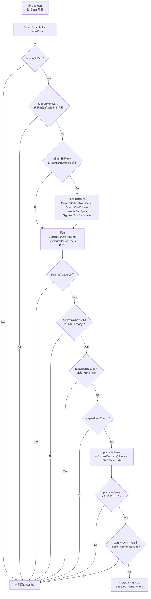
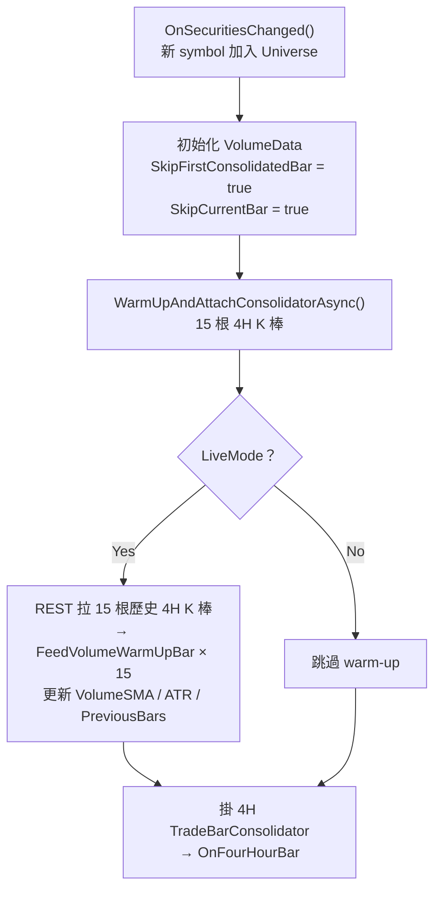

# RisingWithIncreasingVolumeAlpha — 盤中量爆 Alpha

盤中每根 Bar 推估本根 4H 棒的最終成交金額，若預估爆量且為強勢綠 K，發 `Insight.Up`。
同一根 4H 棒內最多發一次訊號，棒收盤時 reset。

---

## 訊號判斷流程（每根 Bar 觸發）



---

## 初始化流程（新 symbol 加入時）



---

## 方法一覽

| 方法 | 觸發時機 | 做什麼 |
|---|---|---|
| `OnSecuritiesChanged` | 新 symbol 加入 Universe | 初始化 `VolumeData`、warm-up 指標、掛 4H Consolidator |
| `FeedVolumeWarmUpBar` | warm-up 期間逐棒 | 餵歷史棒進 `VolumeSMA` / `ATR` / `PreviousBars` |
| `OnFourHourBar` | 每根 4H 棒收盤 | 更新 SMA10 / ATR / PreviousBars，清空盤中累積狀態，reset 訊號旗標 |
| `Update` | 每根 Bar | 累積當前 4H 量、推估全棒量、判斷是否發 `Insight.Up` |
| `GetStopPrice` | Execution 查詢止損 | 回傳上一根已收盤 4H 棒的 Low |

---

## 訊號觸發條件（依序判斷，任一不過即跳過）

| # | 條件 | 說明 |
|:---:|---|---|
| 1 | `BelongsToSource` | symbol 屬於此 Alpha 對應的 Universe 來源 |
| 2 | `ActiveSymbols.Contains` | 通過 LiquidityAdxObvFilter 三層篩選 |
| 3 | `!SignaledThisBar` | 同一根 4H 棒內尚未發過訊號 |
| 4 | `elapsed >= 30 min` | 至少走過 30 分鐘，樣本足夠穩定 |
| 5 | `predictVolume > SMA10 × 1.5` | 推估全棒成交金額超過均值 1.5 倍 |
| 6 | `gain >= ATR × 0.5` | 漲幅達 ATR(14) × 0.5，過濾貼著開盤線爬的疲弱綠 K |

---

## Code Snippets

### Update — 推估全棒量並發訊號

```csharp
// 推估全棒總量 = 累積量 × (240 / 已過分鐘)
var predictVolume = vd.CurrentBarUsdtVolume * (decimal)(FULL_BAR_MINUTES / minutesElapsed);
var threshold = vd.VolumeSma.Current.Value * VOLUME_MULTIPLIER;

if (predictVolume <= threshold)
    continue;

// 漲幅 >= ATR(14) × 0.5
var gain = minuteBar.Close - vd.CurrentBarOpen;
var minGain = vd.Atr.Current.Value * MIN_GAIN_ATR_RATIO;
if (gain < minGain)
    continue;

vd.SignaledThisBar = true;
yield return Insight.Price(symbol, TimeSpanBar, InsightDirection.Up);
```

### OnFourHourBar — 棒收盤後更新狀態

```csharp
private void OnFourHourBar(object sender, TradeBar bar)
{
    if (!_volumeData.TryGetValue(bar.Symbol, out var data))
        return;

    if (data.SkipFirstConsolidatedBar)
    {
        data.SkipFirstConsolidatedBar = false;
        data.SkipCurrentBar = false;
    }
    else
    {
        var usdtVolume = bar.Volume * bar.Close;
        data.VolumeSma.Update(bar.EndTime, usdtVolume);
        data.Atr.Update(bar);
        data.PreviousBars.Add(bar);
    }

    // 重置盤中累積，準備下一根 4H
    data.CurrentBarUsdtVolume = 0m;
    data.CurrentBarStartUtc = null;
    data.CurrentBarOpen = 0m;
    data.SignaledThisBar = false;
}
```

### GetStopPrice — 止損價

```csharp
public override decimal GetStopPrice(Symbol symbol)
{
    if (!_volumeData.TryGetValue(symbol, out var d) || !d.PreviousBars.IsReady)
        return 0;

    return d.PreviousBars[0].Low; // 上一根已收盤 4H 棒的 Low
}
```

---

## 設計說明

- **啟動邊界問題**：程式啟動時間幾乎不會對齊 4H 邊界，第一根 Consolidator 棒只有部分資料。`SkipFirstConsolidatedBar` 讓該棒收盤時不寫入 SMA / ATR / PreviousBars；`SkipCurrentBar` 讓啟動時當前未滿的 4H 棒盤中不發訊號，兩個旗標必須在掛 Consolidator **之前**設好，否則掛上到設旗標之間若 Consolidator 先 fire 會把殘缺棒當正常棒處理。
- **ATR 正規化漲幅門檻**：BTC 與 altcoin 的「1% 漲幅」含義完全不同，用固定 % 門檻會在不同幣種間過鬆或過嚴；改用 `ATR × 0.5` 讓門檻自動跟隨各幣的波動度。
- **Warm-up 順序鎖死在基底**：`WarmUpAndAttachConsolidatorAsync` 強制先 warm-up 再掛 Consolidator。若順序反過來，`await` REST 期間真實 Minute Bar 會先觸發 Consolidator，導致 Live Bar 比歷史 K 棒更早進指標，時序錯亂。
- **30 分鐘起跳**：4H 棒剛開盤時累積量極少，一張大單就能讓 `predictVolume` 爆炸性放大，產生大量假訊號，等 30 分鐘讓樣本穩定後再評估。
