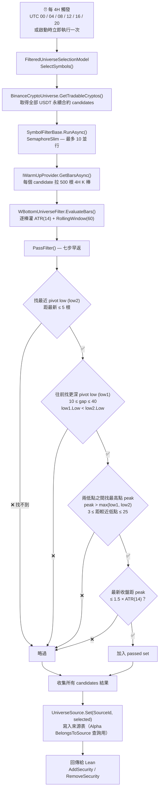

# WBottomUniverseFilter — Live 篩選流程

每 4H 從 Binance 撈所有 USDT 永續合約，掃描最近的 W 底（higher low 反轉型）形態，把通過條件的標的回傳給 Lean。

---

## 完整 Live 流程



---

## W 底規則

| # | 條件 | 規則 | 對應常數 |
|:---:|---|---|---|
| 1 | pivot low 偵測 | 一根 K 棒的 Low 同時低於前 2 根與後 2 根的 Low（fractal） | `FRACTAL_RADIUS = 2` |
| 2 | 最近 pivot（low2） | 距最新 K 棒 ≤ 5 根 | `MAX_LOW2_DISTANCE = 5` |
| 3 | 較早 pivot（low1） | 距 low2 在 10 ~ 40 根之間 | `MIN_PIVOT_GAP = 10`、`MAX_PIVOT_GAP = 40` |
| 4 | higher low 反轉 | `low1.Low < low2.Low`（後低高於前低） | — |
| 5 | 中間 peak 高度 | `peak.High > max(low1.Low, low2.Low)` | — |
| 6 | peak 距較近低點 | 3 ~ 25 根之間 | `MIN_PEAK_SIDE = 3`、`MAX_PEAK_SIDE = 25` |
| 7 | 離頸線距離 | `peak.High - lastClose ≤ 1.5 × ATR(14)`（已突破時差為負自動通過） | `MAX_ATR_MULTIPLE_TO_PEAK = 1.5m` |

七條全部通過才回傳 true。

---

## Code Snippets

### EvaluateBars vs OnFourHourBar — 呼叫時機比較

| | `EvaluateBars` | `OnFourHourBar` |
|---|---|---|
| **觸發者** | `SymbolFilterBase.RunAsync` | `TradeBarConsolidator.DataConsolidated` 事件 |
| **觸發頻率** | 每 4H 跑一次，一次處理所有 candidates | 每根 4H K 棒收盤後逐棒觸發 |
| **輸入資料** | 一次收到 500 根 K 棒（REST 批次拉取） | 每次收到 1 根 K 棒（Lean feed 串流） |
| **指標狀態** | Stateless — 每次建新 `FilterData` | Stateful — `FilterData` 存在 `_filterData` dict，跨棒累積 |
| **更新範圍** | 只判斷當前 symbol，回傳 `bool` | 更新當前 symbol 後，重掃全部 symbols 刷新 `ActiveSymbols` |

### EvaluateBars — 批次計算（Live）

```csharp
protected override bool EvaluateBars(Symbol symbol, IEnumerable<TradeBar> bars)
{
    var fd = new FilterData();
    foreach (var bar in bars)
    {
        fd.Atr.Update(bar);
        fd.Bars.Add(bar);
    }
    return PassFilter(fd);
}
```

### PassFilter — 七步早返

```csharp
private bool PassFilter(FilterData fd)
{
    if (!fd.Atr.IsReady) return false;
    if (fd.Bars.Count < FRACTAL_RADIUS * 2 + MIN_PIVOT_GAP + 1) return false;

    var low2 = FindRecentPivotLow(fd.Bars, MAX_LOW2_DISTANCE, FRACTAL_RADIUS);
    if (low2 == null) return false;

    var low1 = FindEarlierPivotLow(fd.Bars, low2.Value.Index, MIN_PIVOT_GAP, MAX_PIVOT_GAP, low2.Value.Low, FRACTAL_RADIUS);
    if (low1 == null) return false;

    var peak = FindPeakBetween(fd.Bars, low2.Value.Index, low1.Value.Index);
    if (peak == null) return false;

    var twoLowsMax = low1.Value.Low > low2.Value.Low ? low1.Value.Low : low2.Value.Low;
    if (peak.Value.High <= twoLowsMax) return false;

    var distToLow2 = peak.Value.Index - low2.Value.Index;
    var distToLow1 = low1.Value.Index - peak.Value.Index;
    var nearestSide = distToLow2 < distToLow1 ? distToLow2 : distToLow1;
    if (nearestSide < MIN_PEAK_SIDE || nearestSide > MAX_PEAK_SIDE) return false;

    var lastClose = fd.Bars[0].Close;
    if (peak.Value.High - lastClose > MAX_ATR_MULTIPLE_TO_PEAK * fd.Atr.Current.Value) return false;

    return true;
}
```

### IsPivotLow — fractal 局部最低點偵測

```csharp
private static bool IsPivotLow(RollingWindow<TradeBar> bars, int index, int radius)
{
    var center = bars[index].Low;
    for (int k = 1; k <= radius; k++)
    {
        if (center >= bars[index - k].Low) return false;
        if (center >= bars[index + k].Low) return false;
    }
    return true;
}
```

---

## 設計說明

- **RollingWindow 大小 60 推導**：`MAX_PIVOT_GAP(40) + MAX_LOW2_DISTANCE(5) + fractal 兩側各 2 + buffer ≈ 60`。Live 路徑拉 500 根遠超過、不受限；受限的是回測累積上限。
- **RollingWindow 索引方向**：`Bars[0]` 是最新、index 越大時間越早。因此 `low1.index > low2.index > peak.index`（low1 最早、low2 較新、peak 在兩者之間），所有 helper 都依此假設。
- **「fractal 中間根」vs「W 底中間 peak」是不同層次**：fractal 的「中間根」是演算法滑動視窗（5 根 K 棒）中的第 3 根，用來找 pivot low；W 底的「中間 peak」是 low1 ~ low2 整段（10~40 根）的最高點，用純最大值掃描而非 fractal。
- **fractal 半徑取 2**：半徑 3 + `MAX_LOW2_DISTANCE = 5` 會把 low2 偵測窗壓到只剩 3 根有效範圍，太緊；半徑 2 是雜訊過濾與偵測窗的平衡。
- **「已突破」自動通過**：規則是「不要求突破、但不能離頸線太遠」。實作上 `peak.High - lastClose ≤ 1.5 × ATR` 在 `lastClose > peak.High` 時必然成立（差值為負）。語意是「突破後仍在合理範圍」屬於最強型態，pass 合理。
- **Stateless Live + Stateful 回測**：與 `LiquidityAdxObvFilter` 一致 — Live 每次建新 `FilterData` 避免 WebSocket 斷線後指標漂移；回測靠 `TradeBarConsolidator` 累積 `RollingWindow` + `ATR`。
- **OnFourHourBar 全掃 `_filterData`**：與範本一致；W 底評估 O(60) × N symbols 仍是 ms 級，不需優化。
